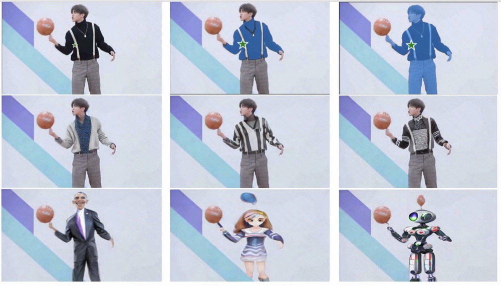
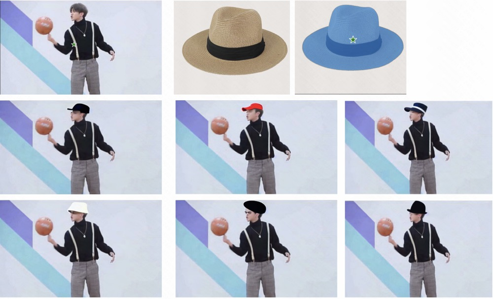
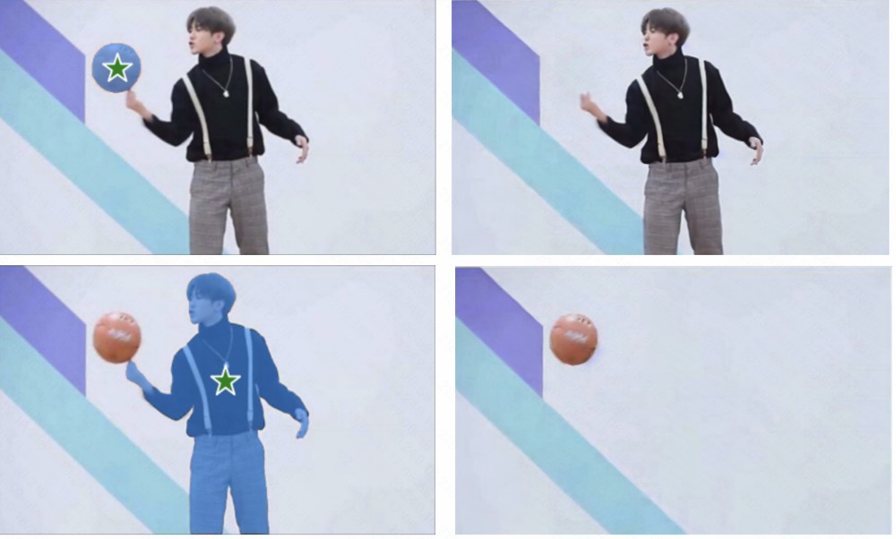

# ShowAnything
Based on [Segment Anything](https://github.com/facebookresearch/segment-anything), we plan to create a very interesting project for image, video generation and editing.

## Image

### Edit


### Object Merge


### Object Remove


### Customization


## Video


## Citation
If you find this project helpful for your research, please consider citing the following BibTeX entry.
```BibTex
@article{kirillov2023segany,
  title={Segment Anything}, 
  author={Kirillov, Alexander and Mintun, Eric and Ravi, Nikhila and Mao, Hanzi and Rolland, Chloe and Gustafson, Laura and Xiao, Tete and Whitehead, Spencer and Berg, Alexander C. and Lo, Wan-Yen and Doll{\'a}r, Piotr and Girshick, Ross},
  journal={arXiv:2304.02643},
  year={2023}
}

```