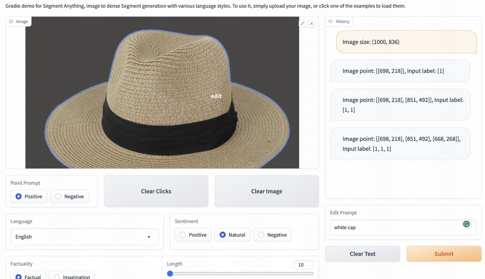
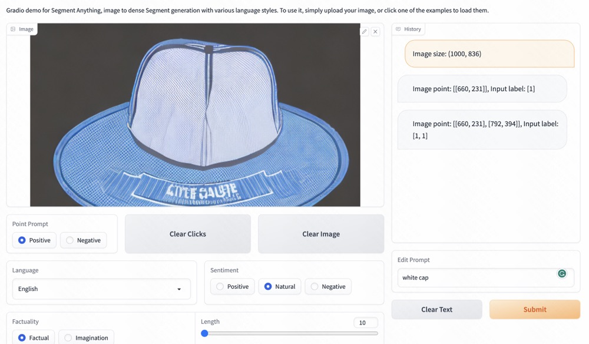
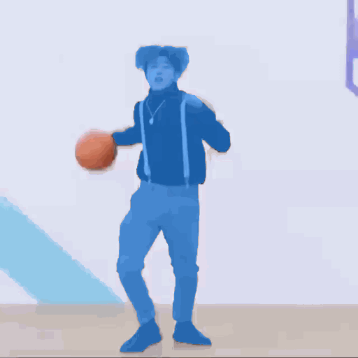

<p align="center">
  
<br>
</p>

# ShowAnything
Based on [Segment Anything](https://github.com/facebookresearch/segment-anything), we plan to create a very interesting project for image, video generation and editing.

**Motivation of this repo**: Segment Anything offers powerful perception capabilities and interfaces with points and boxes. We believe that the interface ability has the potential to greatly drive the development of generation and editing applications. We will be posting some application developments from our lab here that are compatible with both Segment Anything and Generation, thanks.
 
## ToDo
- [ ] Customization (Lora or dreambooth)
- [ ] Video editing with point interaction
- [ ] Hugging Face Demo
- [ ] ...


## Installation
Please follow the [segment anything](https://github.com/facebookresearch/segment-anything#model-checkpoints) to creating the environment and download the model checkpoint (vit_l, vit_l or vit_b)


## Image

[Hugging Face Demo](https://huggingface.co/spaces/weijiawu/ImageEditAnything) is now available, but please note that it may run slowly due to being currently executed on a low-end CPU.


<p align="center">
  
<br>
</p>

<p align="center">
  
<br>
</p>


### Edit with point click
The ultimate goal of this task is to achieve control over the generation of complex scenes, such as dense crowds and department stores.

See the [here](./ImageEdit). Using points to edit and control. Enjoy it! 


<p align="center">
  
<br>
</p>


### Object Merge


<p align="center">
  
<br>
</p>


### Object Remove

<p align="center">
  
<br>
</p>

### Customization


## Video

### Edit with point click


<table class="center">
<tr>
  <td style="text-align:center;"><b>Input Video</b></td>
  <td style="text-align:center;" colspan="3"><b>Output Video</b></td>
</tr>
<tr>
  <td></td>
  <td></td>      
  <td></td>
  <td></td>
</tr>
<tr>
  <td width=25% style="text-align:center;color:gray;">"Input Video with point"</td>
  <td width=25% style="text-align:center;">"A soldier is dancing"</td>
  <td width=25% style="text-align:center;">"Donald Trump is dancing"</td>
  <td width=25% style="text-align:center;">"Iron Man is dancing"</td>
</tr>
</table>


### Video interactive fashion-edit with point click


<table class="center">
<tr>
  <td style="text-align:center;"><b>Input Video</b></td>
  <td style="text-align:center;" colspan="3"><b>Output Video</b></td>
</tr>
<tr>
  <td></td>
  <td></td>      
  <td></td>
  <td></td>
</tr>
<tr>
  <td width=25% style="text-align:center;color:gray;">"Input Video with point(first frame)"</td>
  <td width=25% style="text-align:center;">"A man is dancing in skirt and wearing black stockings"</td>
  <td width=25% style="text-align:center;">"A man is dancing in jeans"</td>
  <td width=25% style="text-align:center;">"A man is dancing in shorts"</td>
</tr>
</table>


## Citation
If you find this project helpful for your research, please consider citing the following BibTeX entry.
```BibTex
@article{kirillov2023segany,
  title={Segment Anything}, 
  author={Kirillov, Alexander and Mintun, Eric and Ravi, Nikhila and Mao, Hanzi and Rolland, Chloe and Gustafson, Laura and Xiao, Tete and Whitehead, Spencer and Berg, Alexander C. and Lo, Wan-Yen and Doll{\'a}r, Piotr and Girshick, Ross},
  journal={arXiv:2304.02643},
  year={2023}
}

```